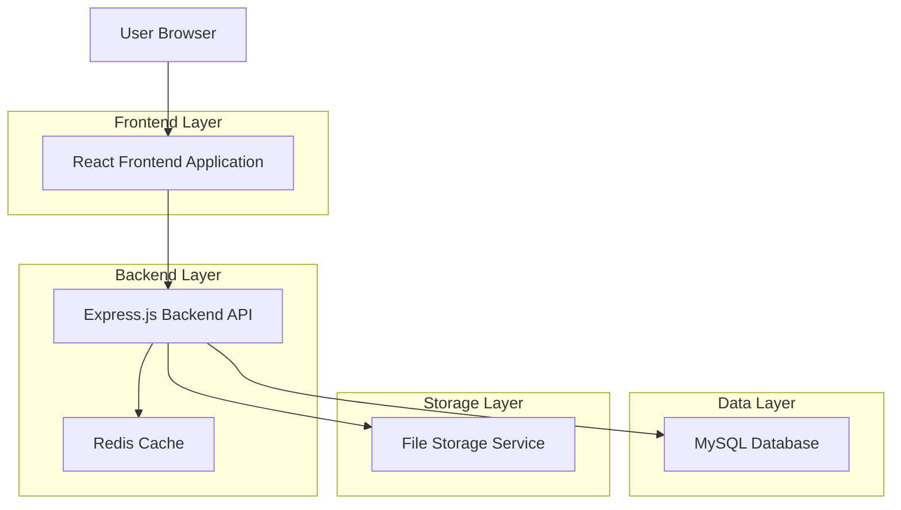
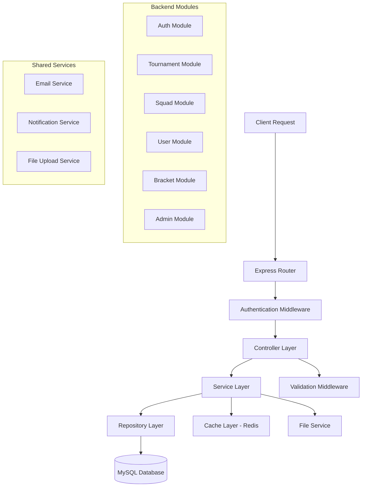
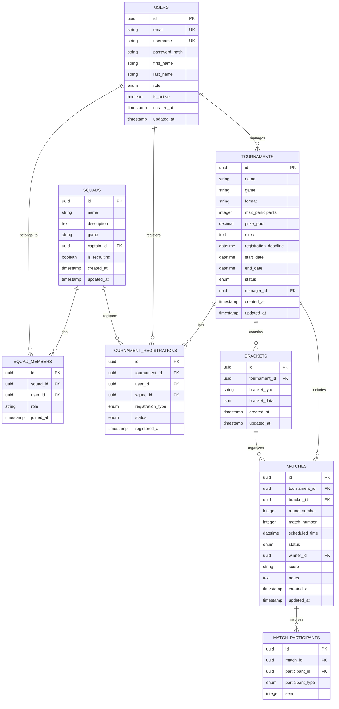

# Esports Website - Technical Architecture Document

## 1. Architecture Design



## 2. Technology Description
- Frontend: React@18 + TypeScript + Tailwind CSS + Vite + React Router + Axios
- Backend: Node.js + Express@4 + TypeScript + Knex.js + MySQL2
- Database: MySQL@8.0 with Knex migrations
- Cache: Redis for session management and performance
- Authentication: JWT tokens with refresh token strategy
- File Storage: Local storage with option for cloud migration

## 3. Route Definitions
| Route | Purpose |
|-------|---------|
| / | Home page with featured tournaments and platform overview |
| /tournaments | Tournament listing with filters and search |
| /tournaments/:id | Tournament details, registration, and bracket view |
| /dashboard | Player dashboard with profile and tournament history |
| /squads | Squad management and team operations |
| /squads/:id | Individual squad details and member management |
| /brackets/:tournamentId | Tournament bracket visualization and results |
| /manager | Tournament manager panel for event management |
| /admin | Site admin panel for platform oversight |
| /login | User authentication page |
| /register | User registration with role selection |
| /profile | User profile management and settings |

## 4. API Definitions

### 4.1 Core API

**Authentication APIs**
```
POST /api/auth/register
```
Request:
| Param Name | Param Type | isRequired | Description |
|------------|------------|------------|-------------|
| email | string | true | User email address |
| password | string | true | User password (min 8 characters) |
| username | string | true | Unique username |
| role | string | true | User role: 'player', 'manager' |
| firstName | string | true | User's first name |
| lastName | string | true | User's last name |

Response:
| Param Name | Param Type | Description |
|------------|------------|-------------|
| success | boolean | Registration status |
| user | object | User information |
| token | string | JWT access token |

```
POST /api/auth/login
```
Request:
| Param Name | Param Type | isRequired | Description |
|------------|------------|------------|-------------|
| email | string | true | User email |
| password | string | true | User password |

Response:
| Param Name | Param Type | Description |
|------------|------------|-------------|
| success | boolean | Login status |
| user | object | User information |
| token | string | JWT access token |
| refreshToken | string | Refresh token |

**Tournament APIs**
```
GET /api/tournaments
```
Query Parameters:
| Param Name | Param Type | Description |
|------------|------------|-------------|
| game | string | Filter by game type |
| status | string | Filter by tournament status |
| page | number | Pagination page number |
| limit | number | Items per page |

```
POST /api/tournaments
```
Request:
| Param Name | Param Type | isRequired | Description |
|------------|------------|------------|-------------|
| name | string | true | Tournament name |
| game | string | true | Game type |
| format | string | true | Tournament format |
| maxParticipants | number | true | Maximum participants |
| registrationDeadline | date | true | Registration deadline |
| startDate | date | true | Tournament start date |
| prizePool | number | false | Prize pool amount |
| rules | string | true | Tournament rules |

**Squad APIs**
```
POST /api/squads
```
Request:
| Param Name | Param Type | isRequired | Description |
|------------|------------|------------|-------------|
| name | string | true | Squad name |
| description | string | false | Squad description |
| game | string | true | Primary game |
| isRecruiting | boolean | false | Recruitment status |

```
POST /api/squads/:id/invite
```
Request:
| Param Name | Param Type | isRequired | Description |
|------------|------------|------------|-------------|
| playerId | string | true | Player ID to invite |
| role | string | false | Role in squad |

**Bracket APIs**
```
GET /api/tournaments/:id/bracket
```
Response:
| Param Name | Param Type | Description |
|------------|------------|-------------|
| bracket | object | Bracket structure |
| matches | array | Match details |
| participants | array | Tournament participants |

```
PUT /api/matches/:id/result
```
Request:
| Param Name | Param Type | isRequired | Description |
|------------|------------|------------|-------------|
| winnerId | string | true | Winner participant ID |
| score | string | false | Match score |
| notes | string | false | Additional notes |

## 5. Server Architecture Diagram



## 6. Data Model

### 6.1 Data Model Definition



### 6.2 Data Definition Language

**Users Table**
```sql
-- Create users table
CREATE TABLE users (
  id CHAR(36) PRIMARY KEY DEFAULT (UUID()),
  email VARCHAR(255) UNIQUE NOT NULL,
  username VARCHAR(50) UNIQUE NOT NULL,
  password_hash VARCHAR(255) NOT NULL,
  first_name VARCHAR(100) NOT NULL,
  last_name VARCHAR(100) NOT NULL,
  role ENUM('player', 'manager', 'admin') DEFAULT 'player',
  is_active BOOLEAN DEFAULT TRUE,
  avatar_url VARCHAR(500),
  created_at TIMESTAMP DEFAULT CURRENT_TIMESTAMP,
  updated_at TIMESTAMP DEFAULT CURRENT_TIMESTAMP ON UPDATE CURRENT_TIMESTAMP
);

-- Create indexes
CREATE INDEX idx_users_email ON users(email);
CREATE INDEX idx_users_username ON users(username);
CREATE INDEX idx_users_role ON users(role);
```

**Squads Table**
```sql
-- Create squads table
CREATE TABLE squads (
  id CHAR(36) PRIMARY KEY DEFAULT (UUID()),
  name VARCHAR(100) NOT NULL,
  description TEXT,
  game VARCHAR(100) NOT NULL,
  captain_id CHAR(36) NOT NULL,
  is_recruiting BOOLEAN DEFAULT FALSE,
  logo_url VARCHAR(500),
  created_at TIMESTAMP DEFAULT CURRENT_TIMESTAMP,
  updated_at TIMESTAMP DEFAULT CURRENT_TIMESTAMP ON UPDATE CURRENT_TIMESTAMP,
  INDEX idx_squads_captain (captain_id),
  INDEX idx_squads_game (game)
);
```

**Squad Members Table**
```sql
-- Create squad_members table
CREATE TABLE squad_members (
  id CHAR(36) PRIMARY KEY DEFAULT (UUID()),
  squad_id CHAR(36) NOT NULL,
  user_id CHAR(36) NOT NULL,
  role VARCHAR(50) DEFAULT 'member',
  joined_at TIMESTAMP DEFAULT CURRENT_TIMESTAMP,
  UNIQUE KEY unique_squad_user (squad_id, user_id),
  INDEX idx_squad_members_squad (squad_id),
  INDEX idx_squad_members_user (user_id)
);
```

**Tournaments Table**
```sql
-- Create tournaments table
CREATE TABLE tournaments (
  id CHAR(36) PRIMARY KEY DEFAULT (UUID()),
  name VARCHAR(200) NOT NULL,
  game VARCHAR(100) NOT NULL,
  format ENUM('single_elimination', 'double_elimination', 'round_robin', 'swiss') NOT NULL,
  max_participants INTEGER NOT NULL,
  prize_pool DECIMAL(10,2) DEFAULT 0,
  rules TEXT NOT NULL,
  registration_deadline DATETIME NOT NULL,
  start_date DATETIME NOT NULL,
  end_date DATETIME,
  status ENUM('draft', 'open', 'closed', 'in_progress', 'completed', 'cancelled') DEFAULT 'draft',
  manager_id CHAR(36) NOT NULL,
  banner_url VARCHAR(500),
  created_at TIMESTAMP DEFAULT CURRENT_TIMESTAMP,
  updated_at TIMESTAMP DEFAULT CURRENT_TIMESTAMP ON UPDATE CURRENT_TIMESTAMP,
  INDEX idx_tournaments_game (game),
  INDEX idx_tournaments_status (status),
  INDEX idx_tournaments_manager (manager_id),
  INDEX idx_tournaments_dates (start_date, end_date)
);
```

**Tournament Registrations Table**
```sql
-- Create tournament_registrations table
CREATE TABLE tournament_registrations (
  id CHAR(36) PRIMARY KEY DEFAULT (UUID()),
  tournament_id CHAR(36) NOT NULL,
  user_id CHAR(36),
  squad_id CHAR(36),
  registration_type ENUM('individual', 'squad') NOT NULL,
  status ENUM('pending', 'approved', 'rejected', 'withdrawn') DEFAULT 'pending',
  registered_at TIMESTAMP DEFAULT CURRENT_TIMESTAMP,
  UNIQUE KEY unique_tournament_participant (tournament_id, user_id, squad_id),
  INDEX idx_registrations_tournament (tournament_id),
  INDEX idx_registrations_user (user_id),
  INDEX idx_registrations_squad (squad_id),
  INDEX idx_registrations_status (status)
);
```

**Brackets Table**
```sql
-- Create brackets table
CREATE TABLE brackets (
  id CHAR(36) PRIMARY KEY DEFAULT (UUID()),
  tournament_id CHAR(36) NOT NULL,
  bracket_type ENUM('main', 'losers', 'consolation') DEFAULT 'main',
  bracket_data JSON NOT NULL,
  created_at TIMESTAMP DEFAULT CURRENT_TIMESTAMP,
  updated_at TIMESTAMP DEFAULT CURRENT_TIMESTAMP ON UPDATE CURRENT_TIMESTAMP,
  INDEX idx_brackets_tournament (tournament_id)
);
```

**Matches Table**
```sql
-- Create matches table
CREATE TABLE matches (
  id CHAR(36) PRIMARY KEY DEFAULT (UUID()),
  tournament_id CHAR(36) NOT NULL,
  bracket_id CHAR(36) NOT NULL,
  round_number INTEGER NOT NULL,
  match_number INTEGER NOT NULL,
  scheduled_time DATETIME,
  status ENUM('scheduled', 'in_progress', 'completed', 'cancelled') DEFAULT 'scheduled',
  winner_id CHAR(36),
  score VARCHAR(100),
  notes TEXT,
  created_at TIMESTAMP DEFAULT CURRENT_TIMESTAMP,
  updated_at TIMESTAMP DEFAULT CURRENT_TIMESTAMP ON UPDATE CURRENT_TIMESTAMP,
  INDEX idx_matches_tournament (tournament_id),
  INDEX idx_matches_bracket (bracket_id),
  INDEX idx_matches_round (round_number),
  INDEX idx_matches_status (status)
);
```

**Match Participants Table**
```sql
-- Create match_participants table
CREATE TABLE match_participants (
  id CHAR(36) PRIMARY KEY DEFAULT (UUID()),
  match_id CHAR(36) NOT NULL,
  participant_id CHAR(36) NOT NULL,
  participant_type ENUM('user', 'squad') NOT NULL,
  seed INTEGER,
  UNIQUE KEY unique_match_participant (match_id, participant_id),
  INDEX idx_match_participants_match (match_id),
  INDEX idx_match_participants_participant (participant_id)
);
```

**Initial Data**
```sql
-- Insert default admin user
INSERT INTO users (id, email, username, password_hash, first_name, last_name, role) 
VALUES (
  UUID(),
  'admin@esports.com',
  'admin',
  '$2b$10$example_hash_here',
  'System',
  'Administrator',
  'admin'
);

-- Insert sample games/categories
INSERT INTO tournaments (id, name, game, format, max_participants, rules, registration_deadline, start_date, manager_id, status)
VALUES (
  UUID(),
  'Sample Championship',
  'League of Legends',
  'single_elimination',
  32,
  'Standard tournament rules apply',
  DATE_ADD(NOW(), INTERVAL 7 DAY),
  DATE_ADD(NOW(), INTERVAL 14 DAY),
  (SELECT id FROM users WHERE role = 'admin' LIMIT 1),
  'open'
);
```
