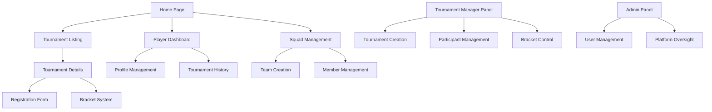

# Esports Website - Product Requirements Document

## 1. Product Overview
A comprehensive esports tournament management platform that enables players to register, form squads, participate in tournaments, and allows tournament managers to organize events with bracket systems.
- Solves the problem of fragmented esports tournament organization by providing a centralized platform for player registration, team management, and tournament administration.
- Target market: Esports communities, gaming organizations, and tournament organizers seeking streamlined event management.

## 2. Core Features

### 2.1 User Roles
| Role | Registration Method | Core Permissions |
|------|---------------------|------------------|
| Player | Email registration with profile setup | Can register for tournaments, join/create squads, view brackets |
| Tournament Manager | Application-based registration with approval | Can create/edit tournaments, manage registrations, control brackets |
| Site Admin | System-level access | Full platform control, user management, system configuration |

### 2.2 Feature Module
Our esports platform consists of the following main pages:
1. **Home page**: hero section, featured tournaments, recent results, platform statistics.
2. **Player Dashboard**: profile management, tournament history, squad memberships, registration status.
3. **Tournament Listing**: active tournaments, upcoming events, registration deadlines, prize pools.
4. **Tournament Details**: tournament information, bracket visualization, registration form, participant list.
5. **Squad Management**: team creation, member invitations, squad profiles, tournament registrations.
6. **Bracket System**: tournament brackets, match results, live updates, advancement tracking.
7. **Tournament Manager Panel**: tournament creation, participant management, bracket control, result entry.
8. **Admin Panel**: user management, tournament oversight, platform analytics, system settings.

### 2.3 Page Details
| Page Name | Module Name | Feature description |
|-----------|-------------|---------------------|
| Home page | Hero section | Display featured tournaments, platform statistics, call-to-action buttons for registration |
| Home page | Tournament showcase | Show upcoming tournaments with registration status, prize pools, participant counts |
| Player Dashboard | Profile management | Edit personal information, gaming profiles, contact details, avatar upload |
| Player Dashboard | Tournament history | View past participations, results, achievements, statistics |
| Player Dashboard | Squad memberships | Display current teams, pending invitations, squad performance metrics |
| Tournament Listing | Tournament grid | Filter tournaments by game, date, status, prize pool with search functionality |
| Tournament Listing | Registration status | Show registration deadlines, participant limits, entry requirements |
| Tournament Details | Tournament info | Display rules, format, schedule, prize distribution, contact information |
| Tournament Details | Registration form | Collect player/squad information, validate eligibility, process payments if required |
| Tournament Details | Participant list | Show registered players/squads, seeding information, contact details |
| Squad Management | Team creation | Create squads with name, description, game focus, recruitment settings |
| Squad Management | Member management | Invite players, manage roles, remove members, set permissions |
| Squad Management | Squad registration | Register entire squads for tournaments, manage multiple tournament entries |
| Bracket System | Bracket visualization | Display tournament brackets with match progression, seeding, advancement paths |
| Bracket System | Match management | Show match schedules, results entry, dispute resolution, live updates |
| Tournament Manager Panel | Tournament creation | Create tournaments with format, rules, dates, prize pools, registration settings |
| Tournament Manager Panel | Participant oversight | View registrations, approve/reject participants, manage waitlists |
| Tournament Manager Panel | Bracket control | Generate brackets, seed participants, manage match progression, enter results |
| Admin Panel | User management | Create/edit/disable user accounts, role assignments, permission management |
| Admin Panel | Platform oversight | Monitor tournaments, resolve disputes, manage platform settings, view analytics |

## 3. Core Process

**Player Flow:**
Players register on the platform, complete their gaming profiles, and can either join existing squads or create new ones. They browse available tournaments, register individually or with their squad, and participate in bracket-based competitions. Players can track their progress through tournament brackets and view results.

**Tournament Manager Flow:**
Tournament managers apply for manager status, create tournaments with specific rules and formats, manage participant registrations, generate and control tournament brackets, enter match results, and oversee the entire tournament lifecycle from creation to completion.

**Admin Flow:**
Admins oversee the entire platform, manage user accounts and permissions, monitor tournament activities, resolve disputes, configure platform settings, and maintain system integrity.

## 4. User Interface Design
### 4.1 Design Style
- Primary colors: Dark blue (#1a1a2e) and electric blue (#16213e), secondary colors: bright orange (#e94560) for highlights
- Button style: Rounded corners with gradient effects and hover animations
- Font: Modern sans-serif (Inter or Roboto) with sizes ranging from 14px to 48px
- Layout style: Card-based design with dark theme, top navigation with sidebar for dashboards
- Icon style: Gaming-focused icons with neon glow effects, esports-themed illustrations

### 4.2 Page Design Overview
| Page Name | Module Name | UI Elements |
|-----------|-------------|-------------|
| Home page | Hero section | Full-width banner with animated background, large CTA buttons, tournament countdown timers |
| Player Dashboard | Profile section | Card-based layout with avatar, stats widgets, progress bars, dark theme with blue accents |
| Tournament Listing | Tournament grid | Grid layout with tournament cards, filter sidebar, search bar, pagination controls |
| Bracket System | Bracket display | Interactive bracket tree, match cards with team logos, progress indicators, responsive design |
| Tournament Manager Panel | Control interface | Tabbed interface, data tables, form modals, action buttons, status indicators |
| Admin Panel | Management interface | Dashboard widgets, user tables, analytics charts, system status indicators |

### 4.3 Responsiveness
Desktop-first design with mobile-adaptive layouts, touch-optimized controls for mobile devices, responsive bracket visualization, and collapsible navigation for smaller screens.
