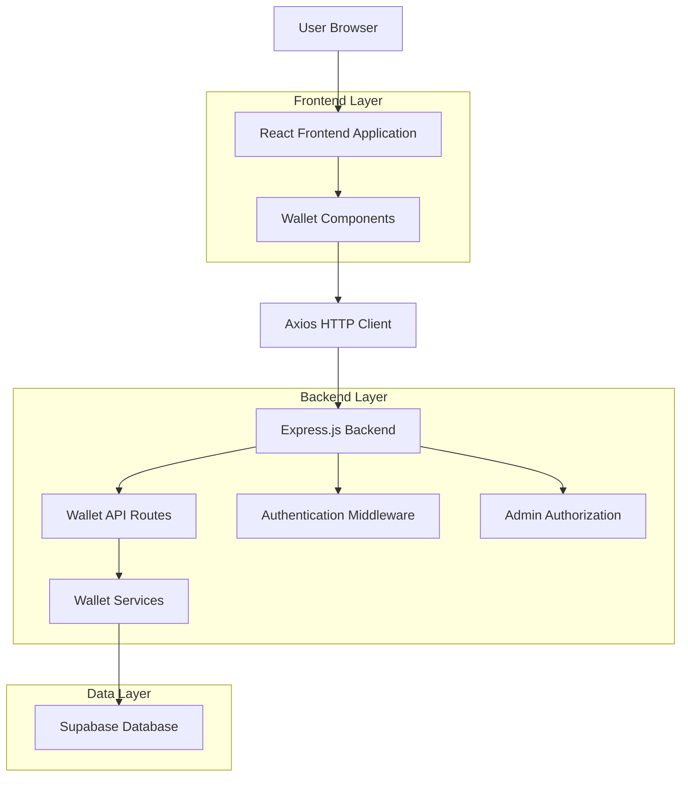
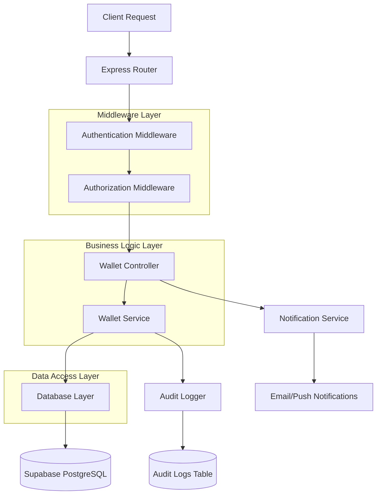
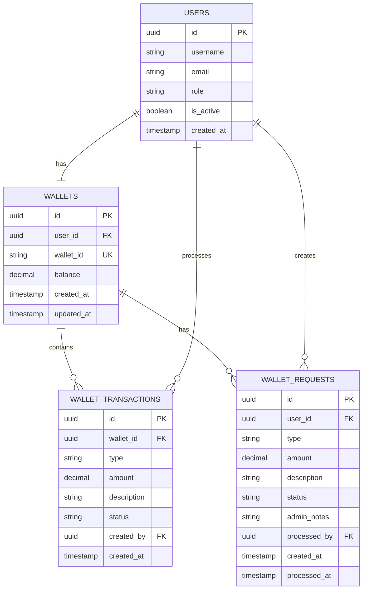

# Wallet System - Technical Architecture Document

## 1. Architecture Design



## 2. Technology Description

- Frontend: React@18 + TypeScript + TailwindCSS + Vite
- Backend: Express@4 + TypeScript + Node.js
- Database: Supabase (PostgreSQL)
- Authentication: JWT tokens with refresh mechanism
- HTTP Client: Axios with interceptors
- UI Components: Custom component library with Lucide icons

## 3. Route Definitions

| Route | Purpose |
|-------|----------|
| /wallet | User wallet dashboard with balance and transaction history |
| /wallet/deposit | Deposit request form |
| /wallet/withdraw | Withdrawal request form |
| /admin/wallet | Admin wallet management panel |
| /admin/wallet/requests | Admin request approval interface |
| /admin/wallet/users | Admin user wallet overview |

## 4. API Definitions

### 4.1 User Wallet APIs

**Get User Wallet**
```
GET /api/wallet
```
Headers:
| Header | Type | Required | Description |
|--------|------|----------|-------------|
| Authorization | string | true | Bearer JWT token |

Response:
| Field | Type | Description |
|-------|------|-------------|
| success | boolean | Request success status |
| data | object | Wallet information |
| data.wallet_id | string | 16-digit wallet ID |
| data.balance | number | Current wallet balance |
| data.created_at | string | Wallet creation date |

Example Response:
```json
{
  "success": true,
  "data": {
    "wallet_id": "1234-5678-9012-3456",
    "balance": 150.75,
    "created_at": "2024-01-15T10:30:00Z"
  }
}
```

**Create Wallet Request**
```
POST /api/wallet/request
```
Request:
| Field | Type | Required | Description |
|-------|------|----------|-------------|
| type | string | true | 'deposit' or 'withdrawal' |
| amount | number | true | Request amount (min: 5, max: 1000) |
| description | string | false | Optional description |

Response:
| Field | Type | Description |
|-------|------|-------------|
| success | boolean | Request success status |
| data | object | Created request information |
| data.id | string | Request ID |
| data.status | string | Request status ('pending') |

Example Request:
```json
{
  "type": "deposit",
  "amount": 100.00,
  "description": "Tournament entry funds"
}
```

**Get Transaction History**
```
GET /api/wallet/transactions
```
Query Parameters:
| Parameter | Type | Required | Description |
|-----------|------|----------|-------------|
| page | number | false | Page number (default: 1) |
| limit | number | false | Items per page (default: 20) |
| type | string | false | Filter by type ('deposit', 'withdrawal', 'admin_adjustment') |

Response:
| Field | Type | Description |
|-------|------|-------------|
| success | boolean | Request success status |
| data | object | Transaction data |
| data.transactions | array | List of transactions |
| data.pagination | object | Pagination information |

### 4.2 Admin Wallet APIs

**Get All Wallet Requests**
```
GET /api/admin/wallet/requests
```
Headers:
| Header | Type | Required | Description |
|--------|------|----------|-------------|
| Authorization | string | true | Bearer JWT token (admin role) |

Query Parameters:
| Parameter | Type | Required | Description |
|-----------|------|----------|-------------|
| status | string | false | Filter by status ('pending', 'approved', 'rejected') |
| type | string | false | Filter by type ('deposit', 'withdrawal') |

Response:
| Field | Type | Description |
|-------|------|-------------|
| success | boolean | Request success status |
| data | array | List of wallet requests |

**Process Wallet Request**
```
PUT /api/admin/wallet/requests/:id
```
Request:
| Field | Type | Required | Description |
|-------|------|----------|-------------|
| action | string | true | 'approve' or 'reject' |
| admin_notes | string | false | Admin notes for the decision |

Response:
| Field | Type | Description |
|-------|------|-------------|
| success | boolean | Request success status |
| message | string | Success/error message |

**Manual Fund Adjustment**
```
POST /api/admin/wallet/manual
```
Request:
| Field | Type | Required | Description |
|-------|------|----------|-------------|
| user_id | string | true | Target user ID |
| type | string | true | 'add' or 'deduct' |
| amount | number | true | Adjustment amount |
| reason | string | true | Reason for adjustment |

Response:
| Field | Type | Description |
|-------|------|-------------|
| success | boolean | Request success status |
| data | object | Updated wallet information |

## 5. Server Architecture Diagram



## 6. Data Model

### 6.1 Data Model Definition



### 6.2 Data Definition Language

**Wallets Table**
```sql
-- Create wallets table
CREATE TABLE wallets (
    id UUID PRIMARY KEY DEFAULT gen_random_uuid(),
    user_id UUID NOT NULL REFERENCES users(id) ON DELETE CASCADE,
    wallet_id VARCHAR(19) UNIQUE NOT NULL, -- Format: 1234-5678-9012-3456
    balance DECIMAL(10,2) DEFAULT 0.00 CHECK (balance >= 0),
    created_at TIMESTAMP WITH TIME ZONE DEFAULT NOW(),
    updated_at TIMESTAMP WITH TIME ZONE DEFAULT NOW()
);

-- Create indexes
CREATE UNIQUE INDEX idx_wallets_user_id ON wallets(user_id);
CREATE UNIQUE INDEX idx_wallets_wallet_id ON wallets(wallet_id);
CREATE INDEX idx_wallets_created_at ON wallets(created_at);

-- Row Level Security
ALTER TABLE wallets ENABLE ROW LEVEL SECURITY;

-- Users can only see their own wallet
CREATE POLICY "Users can view own wallet" ON wallets
    FOR SELECT USING (auth.uid() = user_id);

-- Only authenticated users can update their wallet (through API)
CREATE POLICY "Service role can manage wallets" ON wallets
    FOR ALL USING (auth.role() = 'service_role');

-- Grant permissions
GRANT SELECT ON wallets TO authenticated;
GRANT ALL PRIVILEGES ON wallets TO service_role;
```

**Wallet Transactions Table**
```sql
-- Create wallet_transactions table
CREATE TABLE wallet_transactions (
    id UUID PRIMARY KEY DEFAULT gen_random_uuid(),
    wallet_id UUID NOT NULL REFERENCES wallets(id) ON DELETE CASCADE,
    type VARCHAR(20) NOT NULL CHECK (type IN ('deposit', 'withdrawal', 'admin_add', 'admin_deduct', 'tournament_entry', 'prize_payout')),
    amount DECIMAL(10,2) NOT NULL CHECK (amount > 0),
    description TEXT,
    status VARCHAR(20) DEFAULT 'completed' CHECK (status IN ('pending', 'completed', 'failed')),
    reference_id UUID, -- Reference to request or other entity
    created_by UUID REFERENCES users(id),
    created_at TIMESTAMP WITH TIME ZONE DEFAULT NOW()
);

-- Create indexes
CREATE INDEX idx_wallet_transactions_wallet_id ON wallet_transactions(wallet_id);
CREATE INDEX idx_wallet_transactions_type ON wallet_transactions(type);
CREATE INDEX idx_wallet_transactions_created_at ON wallet_transactions(created_at DESC);
CREATE INDEX idx_wallet_transactions_reference_id ON wallet_transactions(reference_id);

-- Row Level Security
ALTER TABLE wallet_transactions ENABLE ROW LEVEL SECURITY;

-- Users can view transactions for their own wallet
CREATE POLICY "Users can view own transactions" ON wallet_transactions
    FOR SELECT USING (
        wallet_id IN (
            SELECT id FROM wallets WHERE user_id = auth.uid()
        )
    );

-- Grant permissions
GRANT SELECT ON wallet_transactions TO authenticated;
GRANT ALL PRIVILEGES ON wallet_transactions TO service_role;
```

**Wallet Requests Table**
```sql
-- Create wallet_requests table
CREATE TABLE wallet_requests (
    id UUID PRIMARY KEY DEFAULT gen_random_uuid(),
    user_id UUID NOT NULL REFERENCES users(id) ON DELETE CASCADE,
    type VARCHAR(20) NOT NULL CHECK (type IN ('deposit', 'withdrawal')),
    amount DECIMAL(10,2) NOT NULL CHECK (amount > 0),
    description TEXT,
    status VARCHAR(20) DEFAULT 'pending' CHECK (status IN ('pending', 'approved', 'rejected', 'cancelled', 'expired')),
    admin_notes TEXT,
    processed_by UUID REFERENCES users(id),
    created_at TIMESTAMP WITH TIME ZONE DEFAULT NOW(),
    processed_at TIMESTAMP WITH TIME ZONE,
    expires_at TIMESTAMP WITH TIME ZONE DEFAULT (NOW() + INTERVAL '7 days')
);

-- Create indexes
CREATE INDEX idx_wallet_requests_user_id ON wallet_requests(user_id);
CREATE INDEX idx_wallet_requests_status ON wallet_requests(status);
CREATE INDEX idx_wallet_requests_type ON wallet_requests(type);
CREATE INDEX idx_wallet_requests_created_at ON wallet_requests(created_at DESC);
CREATE INDEX idx_wallet_requests_expires_at ON wallet_requests(expires_at);

-- Row Level Security
ALTER TABLE wallet_requests ENABLE ROW LEVEL SECURITY;

-- Users can view their own requests
CREATE POLICY "Users can view own requests" ON wallet_requests
    FOR SELECT USING (auth.uid() = user_id);

-- Users can create their own requests
CREATE POLICY "Users can create own requests" ON wallet_requests
    FOR INSERT WITH CHECK (auth.uid() = user_id);

-- Users can update their own pending requests (for cancellation)
CREATE POLICY "Users can cancel own requests" ON wallet_requests
    FOR UPDATE USING (auth.uid() = user_id AND status = 'pending');

-- Grant permissions
GRANT SELECT, INSERT ON wallet_requests TO authenticated;
GRANT UPDATE(status) ON wallet_requests TO authenticated;
GRANT ALL PRIVILEGES ON wallet_requests TO service_role;
```

**Wallet ID Generation Function**
```sql
-- Function to generate unique wallet ID
CREATE OR REPLACE FUNCTION generate_wallet_id()
RETURNS VARCHAR(19) AS $$
DECLARE
    wallet_id VARCHAR(19);
    exists_check INTEGER;
BEGIN
    LOOP
        -- Generate 16 random digits in format 1234-5678-9012-3456
        wallet_id := 
            LPAD(FLOOR(RANDOM() * 10000)::TEXT, 4, '0') || '-' ||
            LPAD(FLOOR(RANDOM() * 10000)::TEXT, 4, '0') || '-' ||
            LPAD(FLOOR(RANDOM() * 10000)::TEXT, 4, '0') || '-' ||
            LPAD(FLOOR(RANDOM() * 10000)::TEXT, 4, '0');
        
        -- Check if this wallet_id already exists
        SELECT COUNT(*) INTO exists_check FROM wallets WHERE wallets.wallet_id = generate_wallet_id.wallet_id;
        
        -- If unique, exit loop
        IF exists_check = 0 THEN
            EXIT;
        END IF;
    END LOOP;
    
    RETURN wallet_id;
END;
$$ LANGUAGE plpgsql;
```

**Trigger for Automatic Wallet Creation**
```sql
-- Function to create wallet on user registration
CREATE OR REPLACE FUNCTION create_user_wallet()
RETURNS TRIGGER AS $$
BEGIN
    INSERT INTO wallets (user_id, wallet_id, balance)
    VALUES (NEW.id, generate_wallet_id(), 0.00);
    RETURN NEW;
END;
$$ LANGUAGE plpgsql;

-- Trigger to create wallet when user is created
CREATE TRIGGER trigger_create_user_wallet
    AFTER INSERT ON users
    FOR EACH ROW
    EXECUTE FUNCTION create_user_wallet();
```

**Initial Data**
```sql
-- Create wallets for existing users (run once during migration)
INSERT INTO wallets (user_id, wallet_id, balance)
SELECT 
    id,
    generate_wallet_id(),
    0.00
FROM users 
WHERE id NOT IN (SELECT user_id FROM wallets);
```