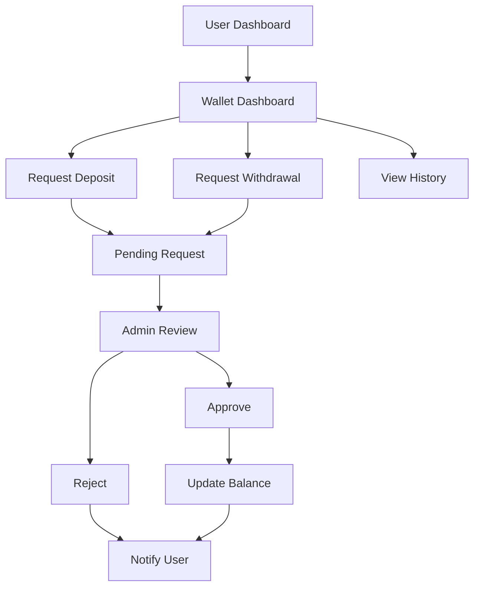

# Wallet System - Product Requirements Document

## 1. Product Overview
A comprehensive digital wallet system for the SENC Esports platform that allows users to manage virtual funds for tournament entries, prizes, and other platform activities. The system operates on manual approval basis without payment gateway integration, providing full administrative control over all financial transactions.

## 2. Core Features

### 2.1 User Roles
| Role | Registration Method | Core Permissions |
|------|---------------------|------------------|
| Player | Existing user account | Can view wallet, request deposits/withdrawals, view transaction history |
| Manager | Existing user account | Same as player + can view squad member wallets |
| Admin | Existing admin account | Full wallet management, approve/reject requests, manual fund adjustments |

### 2.2 Feature Module
Our wallet system consists of the following main components:
1. **User Wallet Dashboard**: wallet balance display, transaction history, deposit/withdrawal request forms
2. **Admin Wallet Management**: request approval interface, user wallet overview, manual fund management
3. **Transaction System**: request tracking, status updates, audit logs
4. **Wallet ID Generation**: unique 16-digit debit card style wallet IDs

### 2.3 Page Details
| Page Name | Module Name | Feature description |
|-----------|-------------|---------------------|
| User Wallet Dashboard | Balance Display | Show current wallet balance, available funds, pending transactions |
| User Wallet Dashboard | Request Forms | Create deposit/withdrawal requests with amount and description |
| User Wallet Dashboard | Transaction History | View all past transactions, requests, and status updates |
| Admin Wallet Panel | Request Management | View, approve, reject deposit/withdrawal requests |
| Admin Wallet Panel | User Wallet Overview | View all user wallets, balances, and quick actions |
| Admin Wallet Panel | Manual Fund Management | Add/deduct funds directly, create admin transactions |
| Admin Wallet Panel | Audit Logs | View complete transaction history and admin actions |

## 3. Core Process

### User Flow
1. User accesses wallet dashboard from profile menu
2. User views current balance and transaction history
3. User creates deposit/withdrawal request with amount and description
4. System generates request with pending status
5. User receives notification when request is processed
6. Approved funds are added/deducted from wallet balance

### Admin Flow
1. Admin accesses wallet management from admin panel
2. Admin reviews pending deposit/withdrawal requests
3. Admin approves or rejects requests with optional notes
4. System updates user wallet balance and sends notifications
5. Admin can manually add/deduct funds with reason
6. All actions are logged in audit trail

## 4. User Interface Design

### 4.1 Design Style
- Primary colors: Blue (#3B82F6) for wallet elements, Green (#10B981) for positive balances
- Secondary colors: Red (#EF4444) for withdrawals, Yellow (#F59E0B) for pending status
- Button style: Rounded corners with subtle shadows, consistent with existing platform design
- Font: Inter font family, 14px base size for wallet amounts, 16px for headings
- Layout style: Card-based design with clean spacing, responsive grid layout
- Icons: Lucide icons for wallet, deposit, withdrawal, and transaction actions

### 4.2 Page Design Overview
| Page Name | Module Name | UI Elements |
|-----------|-------------|-------------|
| User Wallet Dashboard | Balance Card | Large balance display with wallet ID, gradient background, quick action buttons |
| User Wallet Dashboard | Request Forms | Modal dialogs with amount input, description field, confirmation steps |
| User Wallet Dashboard | Transaction List | Table with transaction type icons, amounts, dates, status badges |
| Admin Wallet Panel | Request Queue | Card-based layout with user info, request details, approve/reject buttons |
| Admin Wallet Panel | User Overview | Data table with search, filters, balance columns, action dropdowns |
| Admin Wallet Panel | Manual Actions | Form with user selection, amount input, reason field, confirmation dialog |

### 4.3 Responsiveness
Desktop-first design with mobile-adaptive layout. Touch-optimized buttons for mobile devices. Responsive tables with horizontal scroll on smaller screens. Modal dialogs adapt to screen size with full-screen on mobile.

## 5. Technical Requirements

### 5.1 Database Schema
- **wallets**: user_id, wallet_id, balance, created_at, updated_at
- **wallet_transactions**: id, wallet_id, type, amount, description, status, created_by, created_at
- **wallet_requests**: id, user_id, type, amount, description, status, admin_notes, processed_by, created_at, processed_at

### 5.2 API Endpoints
- GET /api/wallet - Get user wallet info
- POST /api/wallet/request - Create deposit/withdrawal request
- GET /api/wallet/transactions - Get transaction history
- GET /api/admin/wallet/requests - Get all pending requests (admin)
- PUT /api/admin/wallet/requests/:id - Approve/reject request (admin)
- POST /api/admin/wallet/manual - Manual fund adjustment (admin)
- GET /api/admin/wallet/users - Get all user wallets (admin)

### 5.3 Security Features
- JWT authentication for all wallet operations
- Admin role verification for management endpoints
- Input validation and sanitization
- Transaction amount limits and validation
- Audit logging for all admin actions
- Rate limiting on request creation

## 6. Business Rules

### 6.1 Wallet Creation
- Automatic wallet creation upon user registration
- Unique 16-digit wallet ID generation (format: 1234-5678-9012-3456)
- Initial balance of 0.00
- One wallet per user account

### 6.2 Transaction Limits
- Minimum deposit request: $10.00
- Maximum deposit request: $1,000.00
- Minimum withdrawal request: $5.00
- Maximum withdrawal: Current wallet balance
- Daily request limit: 3 requests per user

### 6.3 Request Processing
- All requests require admin approval
- Requests expire after 7 days if not processed
- Users can cancel pending requests
- Approved deposits add funds immediately
- Approved withdrawals deduct funds immediately
- Rejected requests include admin notes

### 6.4 Admin Capabilities
- View all user wallets and balances
- Approve/reject requests with notes
- Manual fund additions with reason
- Manual fund deductions with reason
- View complete audit trail
- Export wallet data and reports